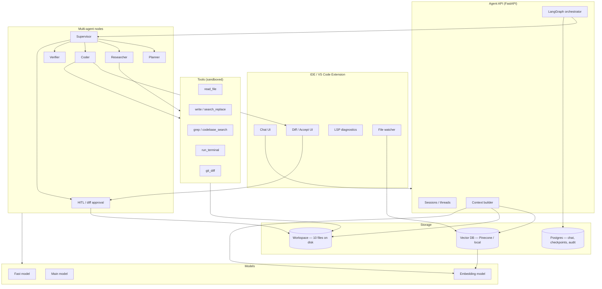
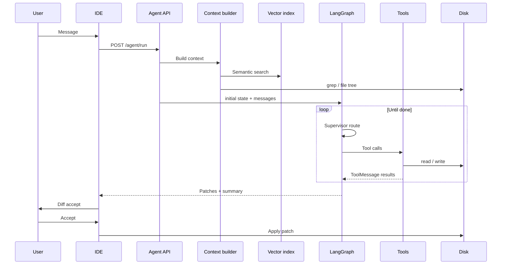
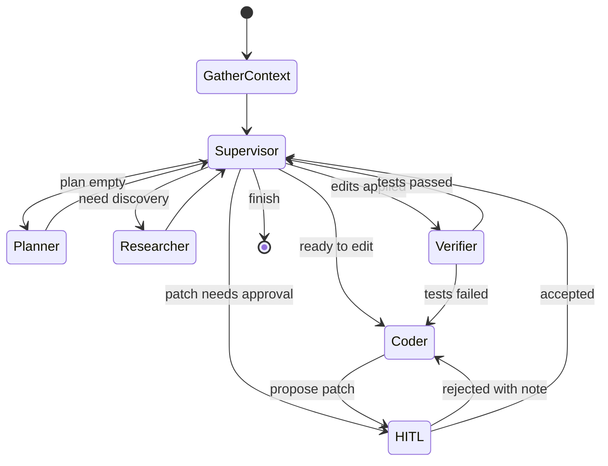
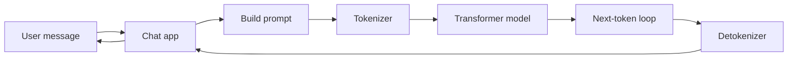
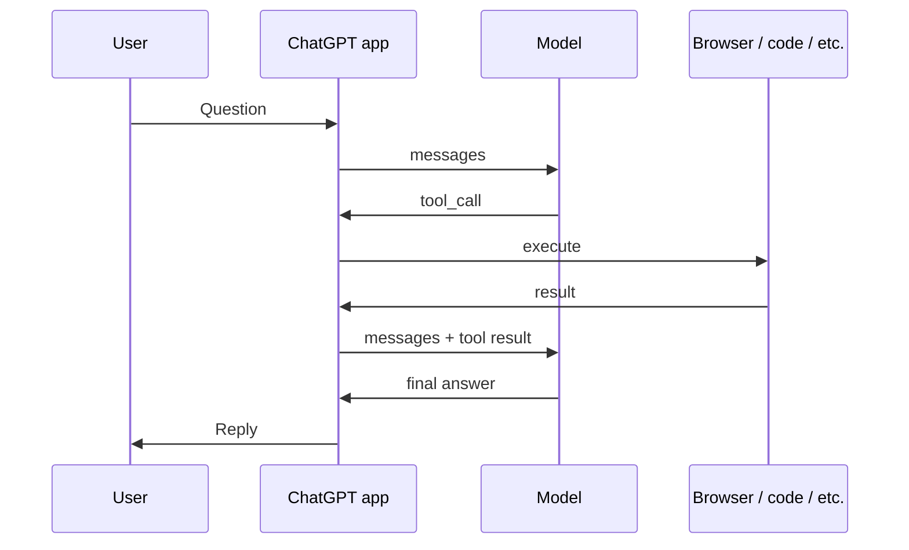

# Coding Agent Architecture (Cursor / Copilot Style)

An end-to-end reference covering:

- **ChatGPT** — how a plain chat LLM works (tokens, scoring, first vs second message)
- **Cursor / Copilot-style agents** — LangGraph, multi-agent orchestration, RAG (Pinecone), tool loops

Includes full dry runs for **first message** (empty chat) and **second message** (with history) for both patterns.

---

## Table of Contents

1. [What You Are Building](#1-what-you-are-building)
2. [System Architecture](#2-system-architecture)
3. [Data Stores](#3-data-stores)
4. [Two Modes: Tab Completion vs Agent](#4-two-modes-tab-completion-vs-agent)
5. [Agent Graph (LangGraph)](#5-agent-graph-langgraph)
6. [Shared State Schema](#6-shared-state-schema)
7. [Prompts & Agents](#7-prompts--agents)
8. [Pinecone Chunks vs read_file](#8-pinecone-chunks-vs-read_file)
9. [Loops Explained](#9-loops-explained)
10. [Dry Run A — First Query (New Repo, Zero Chat History)](#10-dry-run-a--first-query-new-repo-zero-chat-history)
11. [Dry Run B — Second Query (Chat History Exists)](#11-dry-run-b--second-query-chat-history-exists)
12. [Failure & Retry Paths](#12-failure--retry-paths)
13. [MVP Build Checklist](#13-mvp-build-checklist)
14. [Mapping to This Repo (Refund System)](#14-mapping-to-this-repo-refund-system)
15. [How ChatGPT Works (Plain Chat LLM)](#15-how-chatgpt-works-plain-chat-llm)
16. [ChatGPT vs Coding Agent — Side by Side](#16-chatgpt-vs-coding-agent--side-by-side)

---

## 1. What You Are Building

| Product pattern | What the user sees | What runs under the hood |
|-----------------|--------------------|---------------------------|
| **Copilot Tab** | Ghost text as you type | Fast model, short context, no tools |
| **Copilot Chat / Cursor Chat** | Q&A in sidebar | RAG + optional tools |
| **Cursor Agent** | “Implement X” → multi-file diffs | LangGraph supervisor + ReAct tools + HITL diffs |

This document focuses on the **Agent** path (the richest case). Tab completion is noted where it differs.

**Core idea:** The LLM never “sees the whole repo.” A pipeline **selects context**, **agents plan and act with tools**, and **disk + index** stay in sync after edits.

---

## 2. System Architecture



### Request lifecycle (one agent turn)



---

## 3. Data Stores

| Store | Purpose | Example keys / tables |
|-------|---------|------------------------|
| **Disk** | Source of truth for code | `src/utils.py` |
| **Vector DB (Pinecone)** | Semantic search over **chunks** | `chunk_id`, `path`, `start_line`, `end_line`, `embedding` |
| **Postgres — `messages`** | User-visible chat history | `session_id`, `role`, `content` |
| **Postgres — `checkpoints`** | LangGraph resume / crash recovery | `thread_id`, `checkpoint_id`, `state_json` |
| **Postgres — `audit_logs`** | Tool calls for debugging | `agent`, `tool`, `path`, `duration_ms` |
| **Postgres — `pending_edits`** | HITL diffs awaiting accept | `thread_id`, `patch`, `status` |
| **Redis (optional)** | Idempotency, hot task status | `task:{id}` |
| **Local `file_cache` in state** | Avoid re-reading same file in one run | `path → content` |

**Important:** Chat history and agent state are **related but not the same**.

- **Chat DB** = what the user sees in the sidebar.
- **Agent state** = plan, files read, patches, test results — often larger and more structured.

---

## 4. Two Modes: Tab Completion vs Agent

### Mode A — Inline completion (Tab)

| Aspect | Behavior |
|--------|----------|
| Trigger | Keystrokes (debounced) |
| Context | Prefix + suffix around cursor (FIM), nearby tabs |
| Model | Fast, low latency |
| Tools | None |
| LangGraph | Not used |
| Loop | Single forward pass (token generation) |

### Mode B — Agent (this document)

| Aspect | Behavior |
|--------|----------|
| Trigger | User message in chat |
| Context | RAG + grep + rules + selection + **chat history** |
| Model | Main model for plan/code; fast for route/verify |
| Tools | `read_file`, `grep`, `search_replace`, `run_terminal`, … |
| LangGraph | Supervisor + specialist nodes |
| Loop | ReAct until done or HITL |

---

## 5. Agent Graph (LangGraph)



### Node responsibilities

| Node | LLM? | Responsibility |
|------|------|----------------|
| **GatherContext** | No | Index check, vector search, grep, file tree, linter |
| **Supervisor** | Yes (tools: route_*) | Pick next node; enforce cycle limits |
| **Planner** | Yes | Step list JSON only |
| **Researcher** | Yes + tools | Confirm files; load real content into state |
| **Coder** | Yes | Produce unified diff / search_replace |
| **HITL** | No | Wait for user accept/reject |
| **Verifier** | Yes + terminal | `pytest`, read stderr, loop back if fail |

---

## 6. Shared State Schema

Example `CodeAgentState` (TypedDict / Pydantic):

```python
{
    # Identity
    "thread_id": str,
    "session_id": str,
    "user_goal": str,

    # LangChain messages (trimmed if too long)
    "messages": list[BaseMessage],

    # Context from GatherContext
    "file_tree": list[str],
    "retrieved_chunks": list[dict],   # from Pinecone — hints only
    "grep_hits": list[dict],
    "open_file": dict | None,
    "linter_errors": list[dict],

    # Plan
    "plan": list[str] | None,
    "plan_step_index": int,

    # Research / execution
    "file_cache": dict[str, str],     # path -> full content (authoritative)
    "files_read": list[str],
    "research_summary": str | None,

    # Edits
    "patches_proposed": list[dict],
    "patches_applied": list[dict],
    "awaiting_user_approval": bool,

    # Verify
    "terminal_output": str | None,
    "tests_passed": bool | None,

    # Routing
    "next_agent": str | None,
    "cycle_count": int,
    "agent_retry_counts": dict[str, int],

    # HITL
    "hitl_required": bool | None,
    "hitl_reason": str | None,
}
```

**Checkpoint:** After each node, persist `state_json` to Postgres (same pattern as `workflow/graph.py` + `checkpoint/store.py` in this repo).

---

## 7. Prompts & Agents

| File | Agent | System prompt goal |
|------|-------|-------------------|
| `prompts/supervisor.md` | Supervisor | Call exactly one routing tool |
| `prompts/planner.md` | Planner | Output JSON plan only; no code |
| `prompts/researcher.md` | Researcher | Use read/grep; summarize findings |
| `prompts/coder.md` | Coder | Minimal patch; match repo style |
| `prompts/verifier.md` | Verifier | Run tests; report pass/fail |

### Supervisor routing tools (example)

```text
make_plan          → Planner
run_research       → Researcher
write_code         → Coder
verify_changes     → Verifier
finish             → END
escalate_hitl      → HITL
```

### What goes into each LLM call

```text
[System prompt for agent]
[Project rules from .cursorrules]
[Compact state summary: plan step, files_read, tests_passed, ...]
[Retrieved chunk SNIPPETS — optional reminder, not for patching]
[file_cache excerpts for files being edited]
[Recent messages + ToolMessages]
[Human: user goal or verifier errors]
```

---

## 8. Pinecone Chunks vs read_file

| | Pinecone chunks | read_file |
|--|-----------------|-----------|
| **Purpose** | Find *where* to look | Load *truth* from disk |
| **Size** | Small snippets (e.g. 50–100 lines) | Full file or line range |
| **Freshness** | Last index time | Current disk |
| **Used for** | Planner + Researcher hints | Coder patches |
| **Safe to edit from?** | **No** | **Yes** |

### Pipeline rule

```text
Pinecone/grep  →  candidate (path, start_line, end_line)
read_file      →  file_cache[path] = content
Coder          →  patch only from file_cache
on Accept      →  write disk → queue re-index chunk
```

### Avoid redundant reads

Within one `thread_id` run:

1. Researcher: `read_file("src/utils.py")` → store in `file_cache`.
2. Coder: reuse `file_cache["src/utils.py"]` — do **not** read again unless file changed on disk.

---

## 9. Loops Explained

### 9.1 Token loop (inside each LLM call)

Not specific to coding agents — model generates one token at a time until stop. See general LLM docs.

### 9.2 ReAct loop (inside Researcher / Coder / Verifier)

```text
for iteration in 1..max_iterations:
    response = LLM(messages)
    if no tool_calls:
        return final text
    execute tools (parallel waves if independent)
    append ToolMessages to messages
raise MaxIterations → HITL or fail
```

Same pattern as `agents/react_loop.py` in this repo (parallel waves via dependency map).

### 9.3 Supervisor loop (graph level)

```text
START → GatherContext → Supervisor
Supervisor → (Planner | Researcher | Coder | Verifier | HITL | END)
Planner / Researcher / Coder / Verifier → back to Supervisor
cycle_count++ each Supervisor visit; force HITL if > MAX_CYCLES
```

### 9.4 Verify retry loop

```text
Coder → apply patch → Verifier → pytest fail
    → Supervisor → Coder (with stderr in messages)
    → up to MAX_AGENT_RETRIES
```

### 9.5 HITL loop

```text
Coder → propose patch → HITL pending
User Accept  → apply disk → Supervisor → Verifier
User Reject  → note in messages → Coder again
```

---

## 10. Dry Run A — First Query (New Repo, Zero Chat History)

### Starting conditions

```text
Repo:          10 files (example below)
Chat DB:       0 messages
Vector index:  empty (first open)
Agent state:   none
Checkpoints:   none
```

### Example repo (10 files)

```text
my-app/
├── .cursorrules
├── pyproject.toml
├── README.md
├── src/
│   ├── __init__.py
│   ├── main.py
│   ├── pricing.py
│   ├── orders.py
│   └── utils.py
└── tests/
    ├── test_pricing.py
    └── test_orders.py
```

### User message

```text
Implement calculate_xyz in pricing — 10% off if tier is gold.
```

---

### Step-by-step

| Step | Component | What happens | Chat DB | Vector DB | Disk | Agent state |
|------|-----------|--------------|---------|-----------|------|-------------|
| **1** | IDE | Capture message, new `session_id`, `thread_id` | +1 user row | — | — | — |
| **2** | Indexer | Scan 10 files → chunk → embed | — | +chunks | — | — |
| **3** | GatherContext | Tree + vector search + grep `xyz`, `gold`, `tier` | — | read | — | — |
| **4** | API | Build initial state + `[System] + [Human]` | — | — | — | created |
| **5** | Supervisor | `plan` empty → route Planner | — | — | — | cycle=1 |
| **6** | Planner | Plan: ① research ② implement ③ test ④ pytest | — | — | — | `plan` set |
| **7** | Supervisor | Step 0 → Researcher | — | — | — | cycle=2 |
| **8** | Researcher | `read_file(pricing.py)`, `read_file(orders.py)`, `grep gold` | — | — | — | `file_cache` filled |
| **9** | Supervisor | Step 1 → Coder | — | — | — | cycle=3 |
| **10** | Coder | Propose diff adding `calculate_xyz` to `pricing.py` | — | — | unchanged | `patches_proposed` |
| **11** | HITL | UI shows diff; user **Accept** | — | — | **pricing.py updated** | `patches_applied` |
| **12** | Coder | Propose test in `test_pricing.py` | — | — | — | — |
| **13** | HITL | User **Accept** | — | — | **test file updated** | — |
| **14** | Verifier | `pytest tests/test_pricing.py` → pass | audit log | — | — | `tests_passed=true` |
| **15** | Supervisor | `finish` | — | — | — | run complete |
| **16** | API | Stream assistant summary to chat | +1 assistant row | re-index queue | — | cleared |

### Planner output (example)

```json
{
  "plan": [
    "Read pricing.py and orders.py for tier/discount patterns",
    "Implement calculate_xyz(amount, tier) in pricing.py",
    "Add test_calculate_xyz_gold in test_pricing.py",
    "Run pytest on test_pricing.py"
  ]
}
```

### Researcher tool calls (example)

| Tool | Args | Result stored in |
|------|------|-------------------|
| `read_file` | `src/pricing.py` | `file_cache["src/pricing.py"]` |
| `read_file` | `src/orders.py` | `file_cache["src/orders.py"]` |
| `grep` | `gold\|tier` | `grep_hits` |

**Note:** Pinecone already suggested `pricing.py` in step 3; Researcher still **reads disk** into `file_cache` (see [§8](#8-pinecone-chunks-vs-read_file)).

### Coder patch (example)

```python
# src/pricing.py (addition)
def calculate_xyz(amount: float, tier: str) -> float:
    if tier == "gold":
        return round(amount * 0.9, 2)
    return amount
```

### End state (Dry Run A)

| Artifact | Value |
|----------|--------|
| Chat messages | 2 (user + assistant) |
| Files changed | `pricing.py`, `test_pricing.py` |
| Vector index | Updated chunks for changed files |
| Checkpoint | Completed / deleted |

### Timeline (wall clock, illustrative)

```text
0.0s   User sends
0.5s   Index 10 files (first time only)
1.0s   GatherContext (Pinecone + grep)
1.2s   Supervisor → Planner
2.5s   Plan ready
3.0s   Researcher tools (parallel reads)
5.0s   Coder patch #1
       --- user Accept ---
6.0s   Coder patch #2 (test)
       --- user Accept ---
8.0s   pytest pass
9.0s   Assistant reply
```

---

## 11. Dry Run B — Second Query (Chat History Exists)

### Starting conditions (after Dry Run A)

```text
Repo:          10 files — pricing.py already has calculate_xyz
Chat DB:       2 messages (previous user + assistant)
Vector index:  warm (includes calculate_xyz in chunks)
Agent state:   none (previous thread finished)
Checkpoints:   none for new thread
```

### User message (follow-up)

```text
Also handle silver tier — 5% off. Update the test.
```

---

### How turn 2 differs from turn 1

| Aspect | Turn 1 | Turn 2 |
|--------|--------|--------|
| Chat history | Empty | Prior Q + A included in `messages` |
| Index | Full scan | Incremental or full — only changed files if tracked |
| Pinecone | Cold search | Finds existing `calculate_xyz` in `pricing.py` quickly |
| Planner | Full discovery plan | Short plan: edit function + edit test |
| Researcher | Read multiple files | Often **only** `read_file(pricing.py)` + `read_file(test_pricing.py)` |
| Context | “Where is xyz?” | “Change existing xyz for silver” |

---

### Step-by-step (Turn 2)

| Step | Component | What happens | Chat DB | State / cache |
|------|-----------|--------------|---------|---------------|
| **1** | IDE | New message, **same `session_id`**, new `thread_id`** or continue thread | +1 user row (3 total) | — |
| **2** | GatherContext | Embed query “silver 5%”; grep `calculate_xyz` | — | Chunks point to pricing.py |
| **3** | API | Build `messages`: System + **history** + new Human | 3 rows | New state |
| **4** | Supervisor | Route Planner (small change, may skip Planner in optimized graphs) | — | cycle=1 |
| **5** | Planner | Plan: ① read pricing ② patch function ③ patch test ④ pytest | — | 3 steps |
| **6** | Researcher | `read_file(pricing.py)` — sees existing `calculate_xyz` | — | `file_cache` |
| **7** | Coder | search_replace: add `elif tier == "silver": return amount * 0.95` | — | patch proposed |
| **8** | HITL | User Accept | — | disk updated |
| **9** | Coder | Update test: `test_calculate_xyz_silver` | — | patch proposed |
| **10** | HITL | User Accept | — | disk updated |
| **11** | Verifier | `pytest tests/test_pricing.py` → pass | audit | `tests_passed=true` |
| **12** | Supervisor | finish | — | done |
| **13** | API | Assistant: “Added 5% silver discount and tests.” | +1 assistant (4 total) | cleared |

**`thread_id` policy:**

- **New thread per message:** simpler; history replayed from chat DB into `messages`.
- **Same thread:** resume checkpoint optional; use when user says “continue fixing tests.”

### Messages array at step 3 (conceptual)

```text
[SystemMessage: coding agent rules]
[HumanMessage: Implement calculate_xyz ...]      ← turn 1
[AIMessage: Added calculate_xyz ... tests pass.] ← turn 1
[HumanMessage: Also handle silver tier ...]      ← turn 2 (new)
```

GatherContext **also** adds fresh RAG results for the **new** question (silver), not only old chat text.

### Coder patch (example)

```python
def calculate_xyz(amount: float, tier: str) -> float:
    if tier == "gold":
        return round(amount * 0.9, 2)
    if tier == "silver":
        return round(amount * 0.95, 2)
    return amount
```

### Token budget on turn 2

If history + file contents exceed context limit:

1. Summarize turn 1 into a short `AIMessage` (“Implemented calculate_xyz with gold 10%”).
2. Drop raw ToolMessages from turn 1.
3. Keep full `file_cache` only for files being edited.

### End state (Dry Run B)

| Artifact | Value |
|----------|--------|
| Chat messages | 4 |
| `calculate_xyz` | gold + silver |
| Tests | gold + silver cases |
| Index | Re-embed `pricing.py`, `test_pricing.py` |

---

## 12. Failure & Retry Paths

### 12.1 pytest fails

```text
Verifier → stderr in messages → Supervisor → Coder
State: tests_passed=false, terminal_output="AssertionError: ..."
Coder reads file_cache again (or re-read if user edited during HITL)
Max retries → HITL with reason "tests_failed_3_times"
```

### 12.2 User rejects diff

```text
HITL reject + note "use round_money from utils"
→ messages += HumanMessage(note)
→ Coder with file_cache + note
```

### 12.3 ReAct max iterations

```text
Researcher/Coder hits max_iterations
→ hitl_required=true
→ User picks Accept manual edit or Cancel
```

### 12.4 Stale index

```text
User edited file outside agent
→ read_file always wins over Pinecone
→ background re-index on save
```

---

## 13. MVP Build Checklist

### Phase 1 — Chat only

- [ ] VS Code extension → POST message
- [ ] Postgres `messages` table
- [ ] Single LLM call with manual `@file` content in prompt

### Phase 2 — RAG

- [ ] Chunker + Pinecone (or local vector store)
- [ ] GatherContext node: search + grep
- [ ] File tree in prompt

### Phase 3 — Agent graph

- [ ] LangGraph: Supervisor → Researcher → Coder → END
- [ ] Tools: `read_file`, `grep`, `search_replace`
- [ ] `file_cache` in state

### Phase 4 — Quality loop

- [ ] Verifier + `run_terminal`
- [ ] HITL diff UI
- [ ] Checkpoints + audit logs

### Phase 5 — Product

- [ ] `.cursorrules` loader
- [ ] Chat history trim / summarize
- [ ] Re-index on file save
- [ ] Tab completion (separate fast path, no graph)

---

## 14. Mapping to This Repo (Refund System)

| Coding agent | This repo (`Multi-Agent-Refund-System`) |
|--------------|----------------------------------------|
| GatherContext + Pinecone | `vectordb/pinecone_store.py` + policy search |
| Supervisor | `agents/supervisor.py` |
| Planner / Researcher / Coder / Verifier | `validation` / `policy` / `communication` agents |
| ReAct + parallel waves | `agents/react_loop.py` |
| State | `agents/state.py` (`RefundState`) |
| Checkpoints | `checkpoint/store.py`, `workflow/graph.py` |
| HITL | `hitl_node` + `POST /hitl/tasks/{id}/resolve` |
| Async queue | `task_queue_store/kafka_events.py` |
| Prompt registry | `prompts/registry.py` |
| Guardrails | `guardrails/` |
| Tracing | `telemetry/setup.py` |

Swap domain tools:

```text
lookup_customer  →  read_file
search_policies  →  codebase_search (Pinecone)
save_processed_request  →  apply_patch
calculate_refund  →  run_terminal (pytest)
```

The **orchestration skeleton is the same**; only tools and prompts change.

---

## 15. How ChatGPT Works (Plain Chat LLM)

This section explains **ChatGPT-style chat** (one model, no repo tools, no LangGraph). Coding agents (sections 1–14) **add layers on top** of this same core.

### 15.1 Product vs model

| Layer | What it is |
|-------|------------|
| **ChatGPT (product)** | Website/app: UI, login, history, safety filters, model picker |
| **GPT (model)** | Neural network weights that predict the next token |
| **API** | You send `messages[]`; same model core, you own the UI |

Everything below is about the **model at inference time** (when you press Send).

### 15.2 Architecture (simple)



No Pinecone, no `read_file`, no supervisor — unless the **product** adds plugins (web browse, code interpreter, etc.).

### 15.3 What is in the prompt (first message, zero history)

When you open a **new chat** and ask: *"What is the capital of France?"*

```text
[System message — hidden]     "You are ChatGPT, be helpful, safe..."
[User message]                "What is the capital of France?"
```

| Piece | In first chat? |
|-------|----------------|
| System instructions | Yes (hidden) |
| Past user messages | No |
| Past assistant messages | No |
| Your new message | Yes |

The model never “remembers” other chats unless the product has a separate **Memory** feature.

### 15.4 Step-by-step — first message dry run

**User:** `What is the capital of France?`

| Step | What happens |
|------|----------------|
| **1** | App saves your message to **chat DB** (optional, for UI history) |
| **2** | **Tokenizer** splits text into tokens (small pieces), e.g. `What`, ` is`, ` the`, ` capital`, ` of`, ` France`, `?` |
| **3** | Each token → **embedding** (list of numbers) + position (word order) |
| **4** | **Transformer** runs: every token mixes with every earlier token (**attention**) |
| **5** | Last position = summary: *"user asks capital of France"* |
| **6** | **LM head** scores **every word in the dictionary** (vocabulary) |
| **7** | Scores → **probabilities** (softmax); e.g. ` Paris` 88%, ` London` 5%, … |
| **8** | **Pick one** token (usually likely one): ` Paris` |
| **9** | Append ` Paris` to sequence; **repeat** steps 4–8 |
| **10** | Next pick might be `.` then **STOP** |
| **11** | App streams **"Paris."** to the screen; saves assistant message to chat DB |

**Chat DB after turn 1:**

| # | role | content |
|---|------|---------|
| 1 | user | What is the capital of France? |
| 2 | assistant | Paris. |

### 15.5 How the model scores the next token (plain language)

The model does **not** look up a geography database at runtime.

**During training (once, offline):**

- It read billions of lines of text.
- It learned: after patterns like *"capital of France is"*, the next piece was often **Paris**.
- **Weights** (billions of numbers) were adjusted so that situation → **high score** for ` Paris`.

**During your chat (inference):**

1. Previous tokens → mixed into one **summary vector** (attention + layers).
2. That vector is compared to **every dictionary item** → each gets a **score**.
3. Higher score = *"this usually came next in training for text like this."*
4. One token is **chosen** from those scores.

**Analogy:** Student did 10,000 worksheets `Capital of France is ___` with answer key **Paris**. On a new sheet, they fill **Paris** from habit — not by opening an atlas in the exam room.

### 15.6 The next-token loop (core loop)

```text
┌─────────────────────────────────────────┐
│  ALL tokens so far (system + user +     │
│  assistant tokens already generated)    │
└─────────────────┬───────────────────────┘
                  ▼
         Score whole dictionary
                  ▼
            Pick ONE token
                  ▼
            Append to sequence
                  ▼
         Stop? ──yes──► Done, show user
            │
            no
            └──► (loop again)
```

This is the **only** generation loop in basic ChatGPT. No supervisor, no tools.

### 15.7 After one token is picked

| Action | Detail |
|--------|--------|
| Append | New token joins the sequence |
| Stop check | End token, max length, or policy |
| If not stop | Run full model again on **longer** text |
| If stop | Decode tokens → text; return to user |

The model does **not** learn from your message during this chat (weights are frozen).

### 15.8 Second message dry run (history exists)

**Prior chat:**

```text
User:      What is the capital of France?
Assistant: Paris.
```

**New user message:** `What about Germany?`

**Prompt inside the model:**

```text
[System]
[User] What is the capital of France?
[Assistant] Paris.
[User] What about Germany?
```

| Step | Difference from first message |
|------|-------------------------------|
| Context | **Longer** — all prior turns included |
| Attention | "Germany" + "capital" pattern from earlier turn |
| Scores | Next tokens likely ` Berlin`, ` Munich`, … |
| Token budget | Must fit system + history + reply in **context window** |

**Chat DB after turn 2:** 4 messages (2 user, 2 assistant).

If history is too long, the **product** may **drop** old turns or **summarize** them — that is app logic, not the raw model.

### 15.9 Training vs inference (two phases)

| | Training | Inference (ChatGPT) |
|--|----------|---------------------|
| **When** | Months, once | Every time you send a message |
| **Input** | Text with next word hidden | Your full prompt |
| **Goal** | Adjust weights to predict next token | Use fixed weights |
| **Learns from you?** | From public/c licensed data | **No** (standard chat) |

**Extra steps before you ever chat:** SFT (instruction tuning) + RLHF (human preferences) shape helpful/safe style — still not learning from your session live.

### 15.10 Randomness (temperature & top-p)

| Setting | Effect |
|---------|--------|
| **Temperature low** | Almost always picks highest-probability token |
| **Temperature higher** | More variety, more surprises |
| **Top-p** | Only sample from top tokens that cover 90% of probability mass |

Same question can get slightly different wording; core facts often stay similar.

### 15.11 What ChatGPT does **not** do (base chat)

| Myth | Reality |
|------|---------|
| Googles the web live | No (unless **Browse** / tools added) |
| Remembers all past chats | No (unless **Memory** product feature) |
| Updates its brain from your chat | No at inference |
| Picks from dictionary by rules like `if France` | Learned **scores**, not hand-coded `if` |
| Writes full answer in one internal step | **One token per loop** |

### 15.12 ChatGPT with plugins / tools (closer to Cursor)

Modern ChatGPT can add:

| Feature | Like coding agent |
|---------|-------------------|
| Web browse | External retrieval |
| Code interpreter | `run_terminal` in sandbox |
| Custom GPTs | System prompt + tools |

Then the flow becomes: **model proposes tool call → app runs tool → result back in `messages` → model continues** — same **ReAct** idea as Researcher/Coder, but domain differs.



---

## 16. ChatGPT vs Coding Agent — Side by Side

| | **ChatGPT (plain chat)** | **Cursor / Copilot agent** |
|--|--------------------------|----------------------------|
| **Input** | Text messages | Text + repo path + open file |
| **Memory of code** | Only what you paste in chat | Index (Pinecone) + `read_file` |
| **Orchestration** | Single model loop | LangGraph supervisor + multiple agents |
| **Tools** | Optional plugins | `read_file`, `grep`, `pytest`, patch |
| **Truth for edits** | N/A | **Disk** via `file_cache` |
| **Human approve** | No | Diff accept (HITL) |
| **Chat DB** | Message list | Message list + agent state + audit |
| **Core loop** | Score dictionary → pick token → append | Same LLM loop **inside** each agent node |
| **First message** | System + user → generate reply | Index repo + plan + tools + patch |
| **Second message** | History + new user → reply | History + fresh RAG + targeted edits |

**One line:** A coding agent is **many ChatGPT-style LLM calls** wrapped in **graph + tools + file truth**; the token engine underneath is the same family of models.

### 16.1 Unified mental model

```text
                    ┌─────────────────────────────┐
                    │   Next-token engine (LLM)   │
                    │   score → pick → append     │
                    └──────────────┬──────────────┘
                                   │
          ┌────────────────────────┼────────────────────────┐
          │                        │                        │
          ▼                        ▼                        ▼
   ChatGPT chat              ChatGPT + tools          Cursor agent
   (messages only)          (optional plugins)       (LangGraph + repo)
```

---

## Quick reference card

```text
CHATGPT (FIRST MESSAGE):
  System + user → tokenize → mix → score dictionary → pick tokens → reply
  Chat DB: user + assistant

CHATGPT (SECOND MESSAGE):
  System + full history + new user → same loop (longer context)

NEW REPO, FIRST MESSAGE (CODING AGENT):
  Index → GatherContext (Pinecone hints) → Graph
  → Plan → Research (read_file truth) → Code (patch)
  → HITL Accept → Verify → Reply

SECOND MESSAGE:
  Chat history in messages + fresh RAG for new question
  → Shorter plan → Targeted reads → Patch existing code → Verify

GOLDEN RULE:
  Never patch from Pinecone text; patch from file_cache / read_file.
```

---

*Document version: 1.1 — adds ChatGPT plain-chat architecture (§15–16) + coding agent dry runs (§10–11).*
