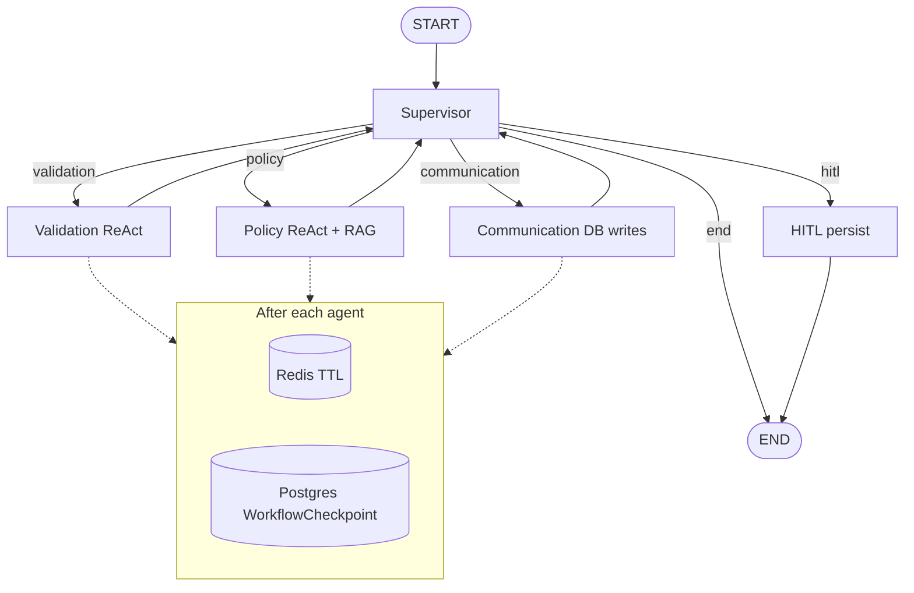

# Section 5: The Big System Design Answer

> **Prepare a crisp 3-minute answer for:**  
> *"Walk me through the most complex LangGraph workflow you built — the state design, the nodes, the edges, and what broke."*

---

## 3-minute script (Warehouse Refund Processing System)

### Context (20 sec)

"We built a **multi-agent refund orchestration system** for warehouse orders. A customer submits email, order ID, and reason; the system validates eligibility, applies policy via RAG, persists the decision, and escalates to humans when automation can't finish safely. It's **LangGraph + FastAPI + Kafka**, with dual-layer checkpoints and HITL."

### State design (40 sec)

"`RefundState` is a TypedDict — one shared object every node reads and patches.

- **Routing sentinels:** `validation_passed`, `decision`, `request_saved`, `next_agent`
- **Business payload:** customer/order fields, refund amount, policy reason
- **Safety:** `cycle_count`, `agent_retry_counts`, `hitl_required`, `thread_id`
- **Messages:** annotated with `operator.add` for audit, but checkpoints **exclude** messages — we persist JSON-safe business fields to Redis and Postgres

The supervisor never parses free-text history; it reads sentinel fields and a short state summary."

### Nodes (50 sec)

"Five graph nodes:

1. **Supervisor** — LLM with four routing tools (`call_validation_agent`, `call_policy_agent`, `call_communication_agent`, `finish_workflow`). Enforces cycle cap 15 and per-agent retry cap 3 before trusting the model. On failure → HITL.

2. **Validation** — ReAct agent with **parallel tool waves**: wave 0 runs customer + order lookup in parallel; wave 1 runs analytics + ownership after `customer_id` exists. Outputs structured `validation_passed`.

3. **Policy** — ReAct with Pinecone policy search, eligibility tools, refund history. RAG over indexed warehouse policies with Redis semantic cache.

4. **Communication** — parallel DB writes: save processed request, analytics, status, audit log. Sets `request_saved`.

5. **HITL** — persists state to `HITLTask`; human resolves via API (approve/deny/compensate)."

### Edges (30 sec)

"Hub-and-spoke: `START → supervisor`, conditional edges to agents based on `next_agent`, every agent returns to supervisor, `hitl → END`. Not a fixed linear pipeline — the supervisor re-enters until sentinels show completion or HITL fires."

### Durability & API (30 sec)

"`POST /refund` returns immediately with `task_id`, publishes **Kafka** `RefundRequested`. Consumer runs `run_workflow`. After each agent, we **checkpoint** to Redis (fast) and Postgres (durable). On crash, resume loads checkpoint — supervisor skips validation if `validation_passed` is already set. Optional **LangGraph AsyncPostgresSaver** on Linux prod."

### What broke (40 sec)

1. **Duplicate policy chunks** — fixed with top-k + semantic cache dedup, not duplicate state keys.

2. **HITL not resuming cleanly** — stale LangGraph checkpoint forked state; we **delete** checkpointer state on approve before re-invoke.

3. **ReAct runaway** — `ReactMaxIterationsError` → HITL instead of hanging.

4. **Double processing from Kafka** — idempotency keys + `ProcessedRequest` unique constraint on `order_id`.

5. **Supervisor loop** — cycle and per-agent retry caps → forced HITL with logged reason.

### Outcome (10 sec)

"End-to-end async refunds with observability (OpenTelemetry/LangSmith), guardrails on user input, RAGAS evaluation hooks, and a clear human escalation path — production-shaped agent infra, not a demo chain."

---

## Diagram

---

## Code anchors (for whiteboard depth)

| Piece | File |
|-------|------|
| State schema | `agents/state.py` |
| Graph compile | `workflow/graph.py` |
| Supervisor | `agents/supervisor.py` |
| Checkpoints | `checkpoint/store.py` |
| API + Kafka | `main.py`, `task_queue_store/kafka_events.py` |

---

## Follow-up questions you should expect

| Question | Short answer |
|----------|--------------|
| Why LLM supervisor vs pure `if` routing? | Flexibility for ambiguous states + tool descriptions encode policy; guards prevent unsafe LLM choices |
| Why not MessageGraph? | Need `validation_passed`, `decision`, retry counters outside messages |
| Exactly-once? | At-least-once Kafka + idempotent DB + sentinel fields |
| vs Temporal? | LangGraph for agent logic; Kafka for work distribution; checkpoints for resume — Temporal if we need native timers/signals at scale |
